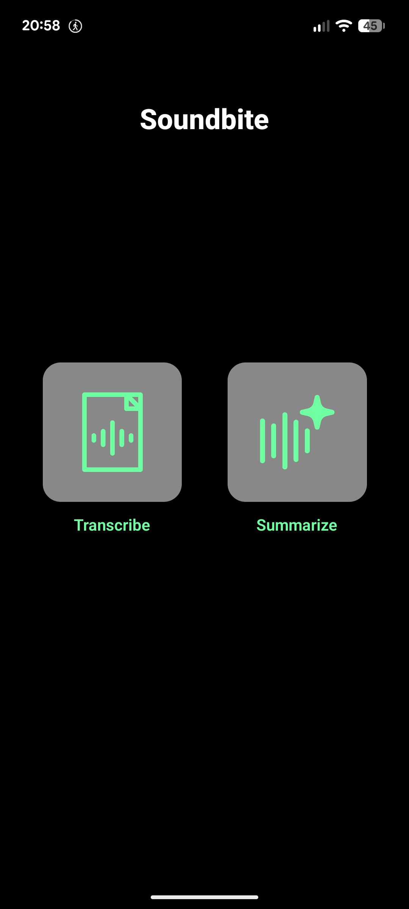
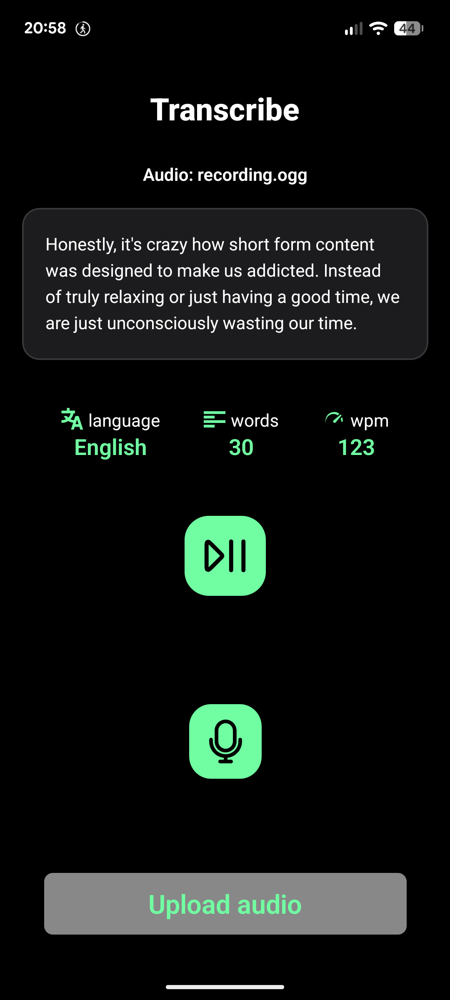
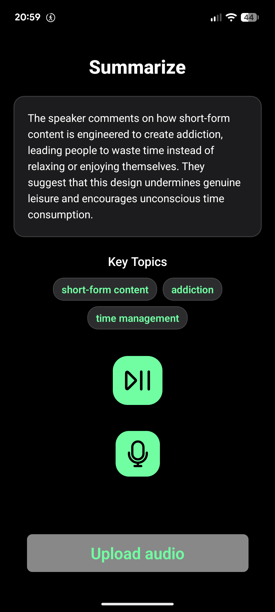

# Soundbyte

  
  &nbsp;&nbsp;&nbsp;&nbsp;
  
  &nbsp;&nbsp;&nbsp;&nbsp;
  

## Overview

**Soundbyte** is a mobile application developed for recording, uploading, and processing human speech. Relies on an asynchronous backend architecture handles audio ingestion, automated transcription, and AI-driven summarization seamlessly.

## Try It Out

### Mobile App (Android)
* **Expo Build:** [Download Build](https://expo.dev/accounts/h4cker/projects/voice-analyzer-app/builds/e6989c0b-f4f6-4b0c-91c5-59217bcdb42f)

## Project Architecture

### Mobile Application

Built using TypeScript, React Native, and Expo. Provides a UI for recording sound from the device’s microphone or uploading existing audio files, and subsequently viewing the results

The app includes two pages:
* **Transcription** – full text transcript, word count, speaking speed, and detected language.
* **Summary** – structured breakdown and key topics covered in the audio recording.

### Backend (FastAPI & Railway)
The backend is built in Python using FastAPI and containerized on Railway. It uses an asynchronous job queue pattern to prevent request timeouts during AI processing tasks:
* `POST /jobs/submit` – Ingests multipart audio files, writes them to a temporary worker space, creates a background job, and returns a unique `job_id`.
* `GET /jobs/{job_id}` – Polls the current status of the processing pipeline and returns structured results.

## Core Processing

* **Grok AI Processing Pipeline:** Uses **Grok** for speech-to-text transcription, word counting, language detection, speed calculations, and generating content summaries and topics.

## Technologies

* **Frontend:** React Native, Expo Go, TypeScript, Expo Router, Axios.
* **Backend:** Python, FastAPI, Railway, Grok API, Uvicorn.

## Workflow

1. The user records or selects an audio file within the mobile app.
2. The file is sent via an HTTP POST request to the FastAPI backend (`/jobs/submit`).
3. The backend initializes a background job, saves the audio stream, and responds with a `job_id`.
4. The mobile app polls the backend (`/jobs/{job_id}`) while background workers process the audio through Whisper and summary services.
5. Finally, the backend returns the results, which the app renders across the Transcription and Summary views.